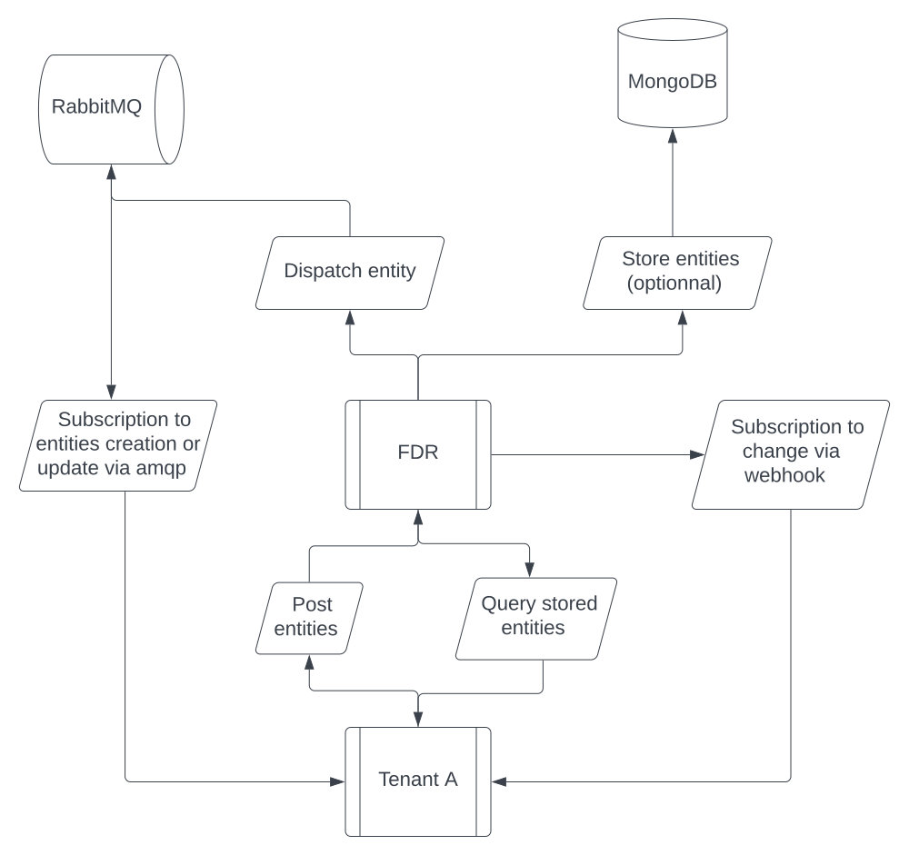

# What is Flexible Data Relay

Flexible Data Relay (FDR) is a software that can be used to share, aggregate and persist data coming from multiple systems (or tenants). 
Each tenant can create or update entities and as they do a GraphQL schema will be dynamicaly generated. This schema will allow other tenants that have been granted access to query it. An allowed tenant can also subscribe to the creation / update of an entity.

## Who is it designed for ?
* Micro services communication : This software can ease the communication between micro services, providing a lot of different ways to pull and put data available for services while still maintaining the core principle of micro sevices : isolation.
* Systems within the same company : Teams developing and maintaining different systems with different languages might want to share data with other systems, while still keeping their architecture as is. With FDR it's just a matter of sending or pulling the data exactly when you need it, no configuration needed.
* Sharing data with trusted partners.
etc...

## Features
* __Administration__:Create tenants using admin HTTP endpoints
* __Entities management__: Tenants can create or update entities by posting to HTTP endpoints or publishing to a RabbitMQ instance (optionally) connected to FDR. An entity is a JSON object containing an __id__ field.
* __Access control__: Tenants can allow other tenants to access their entities.
* __Entities querying__: Tenants can get an entity using its id or get a list of entities, using mongo query syntax, from a GraphQL endpoint.
* __Entities subscription__: Tenants can subscribe to entities creation or update. This subscription can be pointing to a webhook or to the RabbitMQ instance (optionally) connected to FDR.

## Prerequisites
* Docker
* MongoDB replica set that support [change stream](https://www.mongodb.com/docs/manual/changeStreams/).
* (Optionally) RabbitMQ instance.

## Architecture
